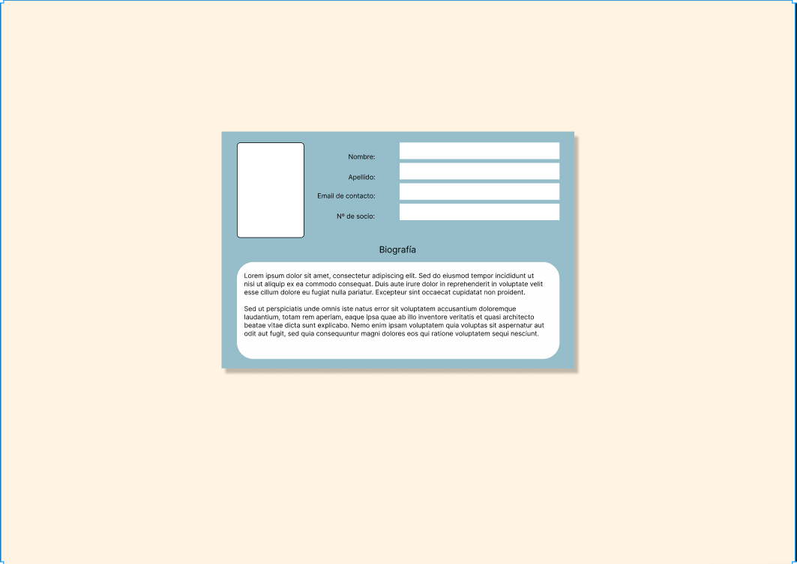

# IFCD65-E1
Prueba práctica del Mod.1 del IFCD65

## 21. Ejercicio práctico: Realiza con ayuda de Figma, Visual Code y las herramientas que consideres el siguiente diseño.

Para ayudarte mejor, el siguiente enlace contiene el diseño realizado para que lo uses de apoyo: [Diseño Figma](https://www.figma.com/design/kzoVAjnue7dga9d7jahsKy/Untitled?node-id=0-3&t=YUXeZ9sf7ymrHssh-1)

Recuerda:
* Puedes preguntar al docente todas las dudas.
* Crear siempre primero los elementos de html y dejar el CSS para el final.
* Usa los conocimientos adquiridos sobre hojas de estilos y css para distribuir bien los
elementos.
* Una vez terminado deberás subirlo a un repositorio de git y escribir en el examen la url al
repositorio.